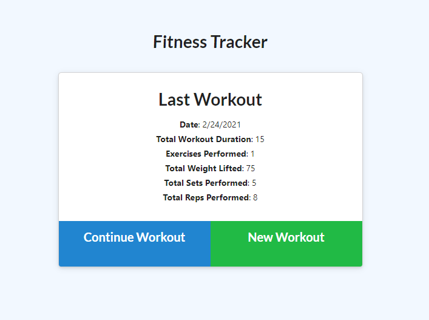
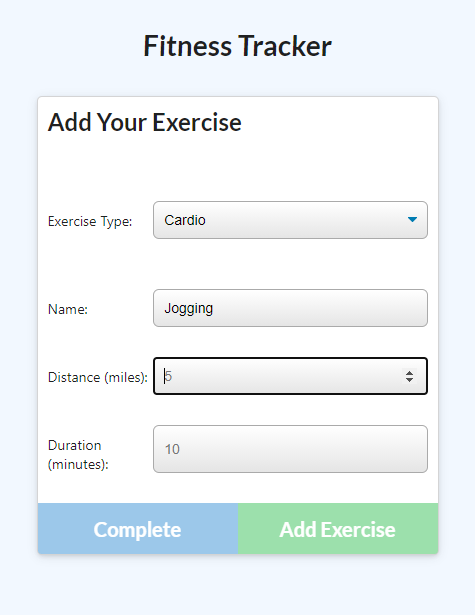
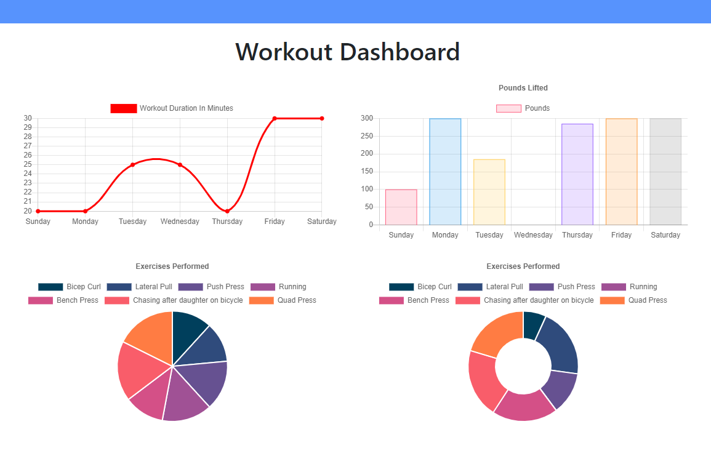

# Fitness Tracker

## Description

Fitness Tracker is a web-based platform for tracking workout data.  This is a full-stack app that demonstrates create/read/update functionality utilizing Mongoose/MongoDB.

## Table of Contents

* [Features](#Features)
* [Links](#Links)
* [Screenshots](#Screenshots)
* [Technology](#Technology)
* [Notes](#Notes)
* [Contributors](#Contributors)
* [License](#License)

## Features
Main Features: 

* Users can:
    * [x] Log new workouts
    * [x] Choose between workout types with pre-configured prompts for details
    * [x] Update the last created workout with new exercise data
    * [x] View aggregated data from past workouts in various chart formats

## Links

* Project Repo: [Repository](https://github.com/danaument/activity-tracker)
* Deployed Application: [Fitness Tracker](https://dashboard.heroku.com/apps/agile-wave-92324)

## Screenshots

## Technology

| Language | Dependencies |  |
| --- | --- | --- |
| Javascript | mongoose | chart.js |
| HTML | morgan | heroku |
| CSS | express | mongodb atlas |

## Contributors
Dan Aument

The front-end components of this project were provided by The Coding Boot Camp at UT Austin in partnership with Trilogy Education Services (the contents of the /public/ and /seeders/ directories).

## Notes

This project was my first with MongoDB and Mongoose.  I really like the utility and performance of this approach to an application database.  I feel like I just barely understand what is going on in the `.aggregate()` method and look forward to using it in the future instead of server or client-side data processing.

## License

MIT © 2021 Dan Aument